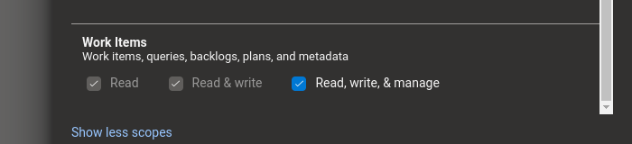

# Noda & Azure DevOps bridge "Proof of Concept"

## About
You should be aware of Noda.io, a VR graph and information modeling software.  With this code and some configuration elements established, you can take a project's Agile workitems and create a formated map in VR with the current data.

## Known Issues
The java server code is using a Java Library "AzD" for interfacing Azure.
https://github.com/hkarthik7/azure-devops-java-sdk

You will need to establish or have access to an Azure DevOps instance, with some work items established.
This tool expect the 'Agile' workflow template to be enabled, but you have the ability to 
remap any specialized cards or workflow in the AzureDevOps.js code.  You will need to establish a Azure 
Personal Access Token for the server bridge to communicate with Azure, it needs to have access to your 
agile boards, teams and backlog.

Ensure the token has the following permissions set.



Modify the ```src/main/resources/application.properties``` to include the generated Personal Access Token
your organization name and primary project name.


## Architecture


Components:
- VR Headset
  - NODA VR Application
    - Noda 
- Azure DevOps instance
  - Azure user credentials to view/edit in browser
      - Personal Access Token (PAT)
      - Work Items that the PAT is allowed to read
      - Agile Process Enabled for the Project
      - A known flat query that returns the dataset you are inerested.
- Local Server/Host
  - Java JDK 17 or better
  - Maven
  - Known Hostname on the same network as the VR Headset
  - Configuration Items updated
  
## Running

Build and Run the Java Bridge API & local web-server
```code
./mvnw clean package spring-boot:run
```

Once Running, the Bridge API is exposed as a Swagger Page
```code
http://[hostname]:8080/swagger-ui/index.html
```

The Node Bridge HTML and JavaScript will be served as
```code
http://[hostname]:8080/content/index.html
```

note:
The Noda Bridge html/js may not work to completion as it relies on services that exist only in the in-application browser.

note:
The Noda Bridge auto refreshes the data & maps for dropdowns from the sever, but will not in a non vr environment.


## Example of the Tool running in VR


